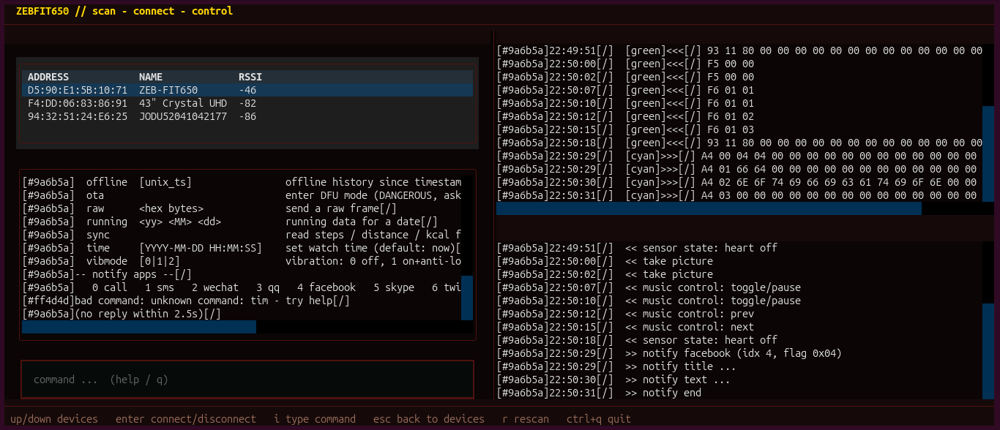

# Zebronics Zebfit 650 Open Client

## Why does this exist?

I have a **Zebronics Zeb 650**, a perfectly functional watch.

The watch works.
The Bluetooth works.
The only problem?

**Zebronics abandoned the app.**

The app disappeared from the Play Store, leaving owners to hunt for questionable APKs just to do something as advanced as... **setting the fucking time.**

So this project started with:

> **"I just fucking want to set the time."**

Then:

> "Oh. I need the app."

> "The app isn't available."

> "Fine, I'll find the APK."

> "Wait, I don't trust some random APK with my data."

> **"Fuck it. I'll do it myself."**

Two days of APK decompilation, BLE UUID hunting, packet decoding, endpoint discovery, and questionable life choices later:

**we have a working independent client.**

Because apparently reverse-engineering an entire smartwatch was easier than finding a functioning companion app.

## Demo



## What works

* BLE discovery and connection
* Time synchronization
* Device information
* Activity data
* Notifications
* Live heart-rate data
* Vibration configuration
* History synchronization
* Raw + decoded BLE frame inspection

## What's inside

| Path                  | Description                                                                            |
| --------------------- | -------------------------------------------------------------------------------------- |
| `BLE_PROTOCOL.md`     | GATT services, characteristics, commands, responses, packet formats and checksum rules |
| `bletest/tui.py`      | Terminal UI for connecting to and controlling the watch                                |
| `bletest/protocol.py` | Command builders and response decoder                                                  |
| `bletest/main.py`     | CLI interface for scripting and testing                                                |
| `bletest/test_tui.py` | Headless TUI smoke test — no watch required                                            |
                                               
## Requirements

* Linux
* Bluetooth adapter with BlueZ
* Python 3.10+
* Zebronics Zeb 650 / `ZEB-FIT650`

## Quickstart

```bash
python -m venv .venv
.venv/bin/pip install -e ./

# Test without a watch
.venv/bin/python bletest/test_tui.py

# Start the TUI
.venv/bin/python bletest/tui.py
```

Make sure the watch is disconnected from other devices and advertising.

## Examples

### Set the time

```text
gettime
```

"What time does this thing think it is?"

```text
time
```

"Okay, we're fixing that."

---

### Heart rate

```text
heart
```

Starts live heart-rate measurements.

```text
heart off
```

Stops them.

Congratulations, your abandoned smartwatch is now reporting its heartbeat to a Linux terminal.

---

### Notifications

```text
notify 7 "Dinner is ready"
```

Sends a notification to the watch.

```text
notify 0 "Incoming call"
```

Sends a call-style notification.

Because apparently the terminal is now your phone.

---

### Activity data

```text
sync
```

Reads available data such as steps, distance and calories.

```text
hist
offline
running
```

For the brave: history and activity synchronization.

---

### Other commands

```text
vibmode 2
info
clear
help
```

The TUI also shows raw BLE frames alongside their decoded meaning, so you can see exactly what is being sent to and received from the watch.

## Where I stop

The original mission was simple:

**Set the time.**

That somehow became:

**Reverse-engineer the BLE protocol.**

And then:

**Send messages. Receive data. Build a TUI. Document everything.**

That's enough for me.

If you want to take it further:

**Fork it. Break it. Improve it.**

Build an Android app. Make a GUI. Add features. Reverse-engineer the stuff I didn't.

**The protocol is yours now.**

Go make the watch do something stupid.

But this is a cheap watch. You didn't have to go this far.

Yeah, I know.

**That's not the fucking point.**

I bought it. I own it. I'll decide when I don't need it anymore.

You don't get to abandon the software and render perfectly fine hardware useless.

**I'll decide when I'm done with my watch. Not you, Zebronics.**


## Legal

Unofficial software for interoperability with compatible hardware.

No proprietary app binaries or decompiled application code are distributed.

Zebronics and Zeb 650 are referenced only to identify compatible hardware.

**License: TBD**
